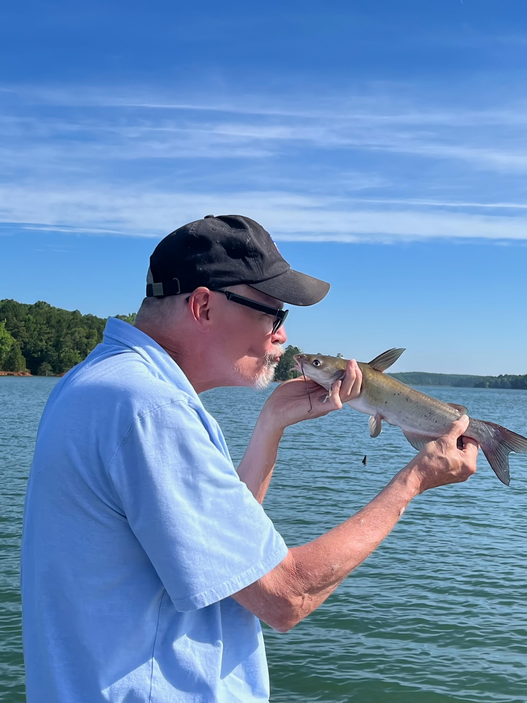
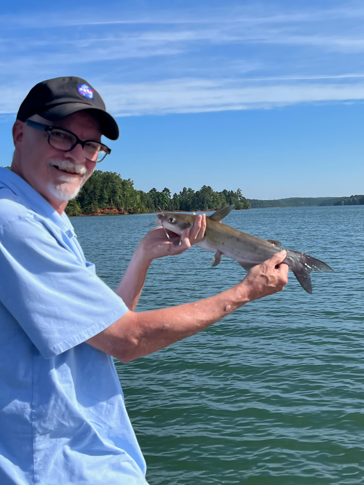

# Tom Hughes 👋

<!--
**mnkth01a/mnkth01a** is a ✨ _special_ ✨ repository because its `README.md` (this file) appears on your GitHub profile.

Here are some ideas to get you started:

- 🔭 I’m currently working on ...
- 🌱 I’m currently learning ...
- 👯 I’m looking to collaborate on ...
- 🤔 I’m looking for help with ...
- 💬 Ask me about ...
- 📫 How to reach me: ...
- 😄 Pronouns: ...
- ⚡ Fun fact: ...
-->

## A Little History

I have worked as an Industrial Automation programmer/Engineer for over 40 years.  When I wasn't programming PLC's or industrial robots, I would write programs in C++, Python, and MicroPython for Arduinos and RaspBerry Pi's.

## Current Projects

- I am working on building a skeleton frame for a full stack web development project that provides responsiveness and interactivity.
  - To do that, I am going through Codecademy's "Full Stack Web Engineer" course, and applying what I learn.
  - You can visit the [_Template_ repository here](https://github.com/mnkth01a/templates.git) to watch the progress.
 
- Next project here!

<!-- 

_Tom kissing a catfish_

<!-- 

_Tom smiling at catching a fish, even a little catfish!_
-->
